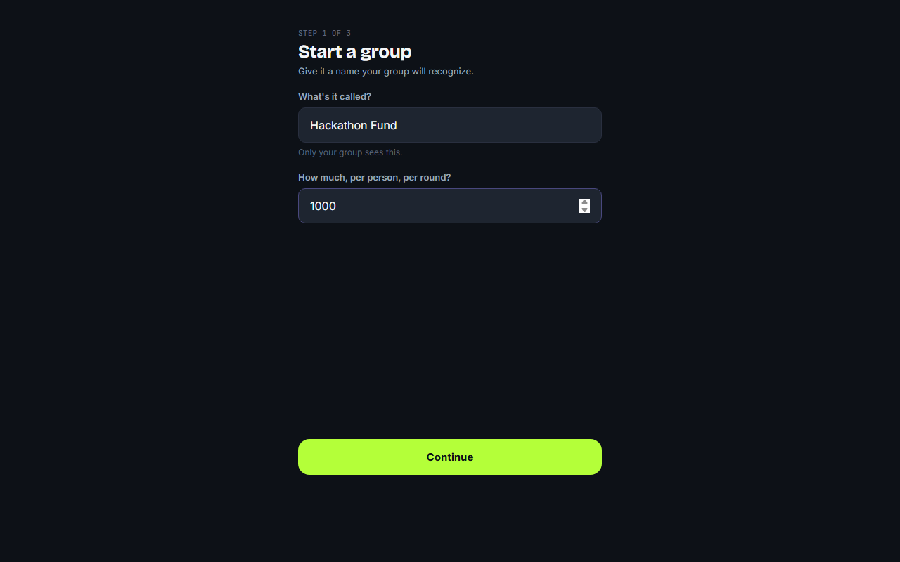
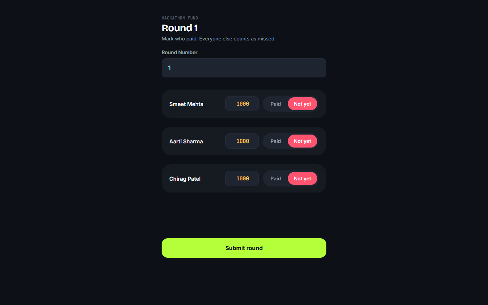
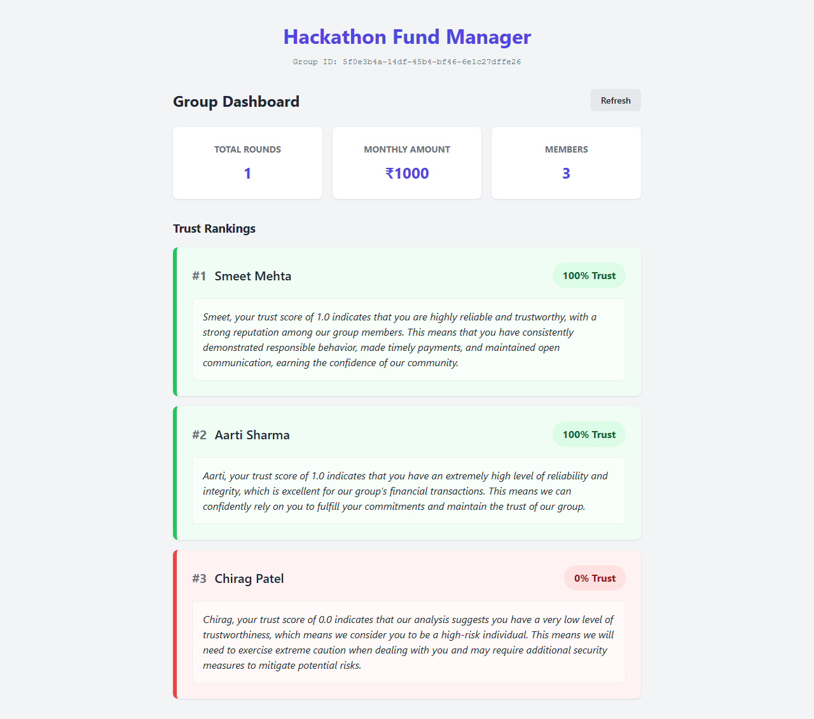

# Hackathon Chit Fund Trust Engine

An AI-powered trust scoring and management platform designed to bring transparency and reliability to informal chit funds and ROSCAs (Rotating Savings and Credit Associations). By leveraging lightweight machine learning and generative AI, the platform tracks member payment history, automatically computes a dynamic "Trust Score", and generates natural language explanations to help groups manage financial risk.

## 🚀 Live Demo
**[https://main.d2wkw0tz96iy0b.amplifyapp.com](https://main.d2wkw0tz96iy0b.amplifyapp.com)**

## 🏗️ Architecture (AWS Native)
This project is built entirely on AWS utilizing serverless components:
- **AWS Lambda**: A Mono-Lambda architecture (Python 3.11) handling all backend logic and routing.
- **Amazon DynamoDB**: A fully managed NoSQL database using Single-Table Design to store groups, members, payment rounds, and Bedrock inference caches efficiently.
- **Amazon API Gateway**: HTTP API for low-latency, cost-effective routing to the backend Lambda.
- **AWS Amplify Hosting**: Global CDN hosting for the Vite + React frontend application.
- **Amazon Bedrock**: Utilizing `Llama 3.1 8B` (via cross-region inference profiles) to generate human-readable trust score explanations.

## 🧠 How the AI Works
The application uses a two-step AI approach:
1. **Trust Scoring (Logistic Regression)**: A lightweight, trained logistic regression model extracts features from a member's payment history (e.g., % paid on time, average days late, payment consistency) and computes a localized Trust Score between 0 (high risk) and 1 (highly reliable).
2. **Generative Explanations (Bedrock)**: The numerical score is passed to Llama 3.1 8B via Amazon Bedrock, which generates a brief, natural language explanation of the member's reliability, acting as a virtual financial advisor for the group. These explanations are cached in DynamoDB to minimize Bedrock invocation costs.

## 🔌 API Endpoints
- `POST /groups` - Creates a new chit fund group and returns the `groupId`.
- `POST /groups/{groupId}/members` - Adds a new member to an existing group.
- `POST /groups/{groupId}/rounds/{roundNumber}` - Logs a payment round for all members in the group (batch write).
- `GET /groups/{groupId}/dashboard` - Retrieves the group profile and all members sorted by Trust Score, including AI explanations.

## 📸 Screenshots

## 💻 Tech Stack
- **Frontend**: React, Vite, Plain CSS
- **Backend**: Python 3.11 (Boto3)
- **Infrastructure as Code (IaC)**: AWS SAM / CloudFormation

## 🤖 AI Disclosure
In compliance with hackathon rules, this project was developed with the assistance of AI coding tools (Google Antigravity / Gemini) to accelerate boilerplate creation, cloud deployments, and architectural planning.
